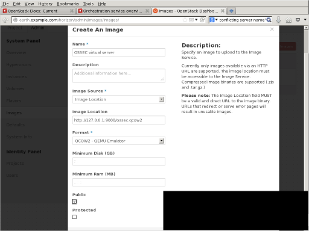

.. _manual-vm-install:

Server Virtual Appliance Installation 
=====================================

Overview:
---------

The OSSEC virtual appliance is a virtual system in the  Open Virtualized Format (OVF). 
It contains an OSSEC 2.7 server installation and the WebUI (0.8 Beta). 

Accounts and passwords:
-----------------------

The default password for all accounts on the system is ``_0ssec_``. 
The username from the WebUI is ``user``, and for phpMyAdmin it is ``root``.

Importing the image on VMWare:
------------------------------

Importing the image on KVM:
---------------------------

Importing the image on QEMU:
----------------------------

Importing the image on VirtualBox:
----------------------------------

Importing the image on OpenStack:
---------------------------------

`Larger version <./img/openstack/openstack_import_virtual_server.png>`_

.. Importing the image on XXX:
.. ---------------------------

Convert OVF to a VMWare image:
------------------------------

Some VMWare desktop environments may not support the OVF images natively, 
for those systems VMWare created the ovftool. 
Download the ovftool from `VMWare's site 
<https://my.vmware.com/group/vmware/get-download?downloadGroup=CVF-TOOL-3-0-1>`_ 
(registration required).

Convert the file using the following procedure:

.. code-block:: console

   # tar zxvf ossec_virtual_apliance.tar.gz
   # cd ossec_virtual_appliance
   # ovftool ossec.ovf ossec.vmx

Convert OVF to qcow2:
---------------------

QEMU, used by kvm and other virtualization services, prefers the qcow2 format. 
The QEMU project provides the `qemu-img <http://en.wikibooks.org/wiki/QEMU/Images>`_ program, 
which can convert an image.

.. warning::

   This is currently untested.

Convert the file using the following procedure:

.. code-block:: console

   qemu-img convert -O qcow2 ossec.ovf ossec.qcow2
