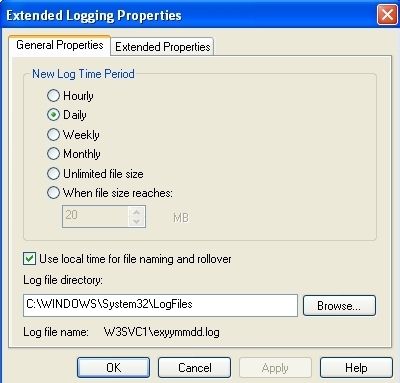
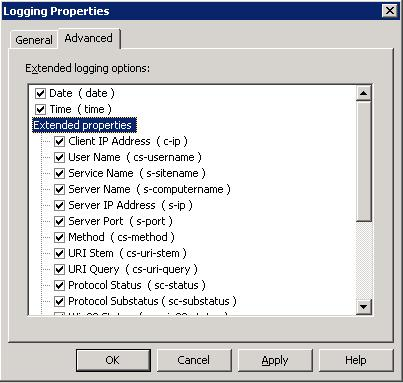

.. _manual-filemon:

File Monitoring
===============

Overview 
--------

OSSEC has a process named ``ossec-logcollector`` that monitors the configured log files for new events. 
When new log messages arrive, it forwards them to other processes for analysis or transport to an OSSEC server. 

Configuration
-------------

The configuration for ossec-logcollector exists in ``/var/ossec/etc/ossec.conf`` in the ``<ossec_config>`` section.
The syntax can be found in the `localfile syntax page <../../syntax/head_ossec_config.localfile.html>`_

Configuration examples
---------------------- 

Simple example 
^^^^^^^^^^^^^^

Configuring a log file to be monitored is simple. Just provide the name of the 
file to be monitored and the format:

.. code-block:: xml 

    <localfile>
        <location>/var/log/messages</location>
        <log_format>syslog</log_format>
    </localfile>

Windows EventLog Example 
^^^^^^^^^^^^^^^^^^^^^^^^ 

To monitor a Windows event log, you need to provide the format as “eventlog” 
and the location is the name of the event log. Example:

.. code-block:: xml 

    <localfile>
        <location>Security</location>
        <log_format>eventlog</log_format>
    </localfile>

Multiple Files Example 
^^^^^^^^^^^^^^^^^^^^^^

To check multiple files, OSSEC supports posix regular expressions. 
For example, to analyze every file that ends with a .log inside the /var/log directory, 
use the following configuration:

.. code-block:: xml 

    <localfile>
        <location>/var/log/*.log</location>
        <log_format>syslog</log_format>
    </localfile>

Date Based Example 
^^^^^^^^^^^^^^^^^^ 

For log files that change according to the date, you can also specify a strftime format 
to replace the day, month, year, etc. For example, to monitor the log 
C:\\Windows\\app\\log-08-12-15.log, where 08 is the year, 12 is the month and 15 the 
day (and it is rolled over every day), do:

.. code-block:: xml 

    <localfile>
        <location>C:\Windows\app\log-%y-%m-%d.log</location>
        <log_format>syslog</log_format>
    </localfile>

.. warning::

   Wildcards cannot be combined with the date based format.

IIS Logs Example 
^^^^^^^^^^^^^^^^

Support for IIS (5 and 6) is available for the NCSA format (web only) and the W3C 
extended format (for Web, FTP and SMTP). By default, the installation scripts will 
attempt to configure OSSEC to monitor the first virtual hosts for web (W3SVC1 to 
W3SVC254), ftp (MSFTPSVC1 to MSFTPSVC254) and smtp (SMTPSVC1 to SMTPSVC254). 
To monitor any other file you need to add a new entry manually.

In addition to that, make sure to set the log time period to daily. 

And using the local time for file naming and rollover.

.. image:: w3c-opt3.jpg 

In the extended logging properties, configure it to log the Date, Time and 
all the extended properties.

The following is an example of configuration to monitor the virtual server 2 
of IIS web

.. code-block:: xml 

    <localfile>
        <location>%WinDir%\System32\LogFiles\W3SVC3\ex%y%m%d.log</location>
        <log_format>iis</log_format>
    </localfile>

