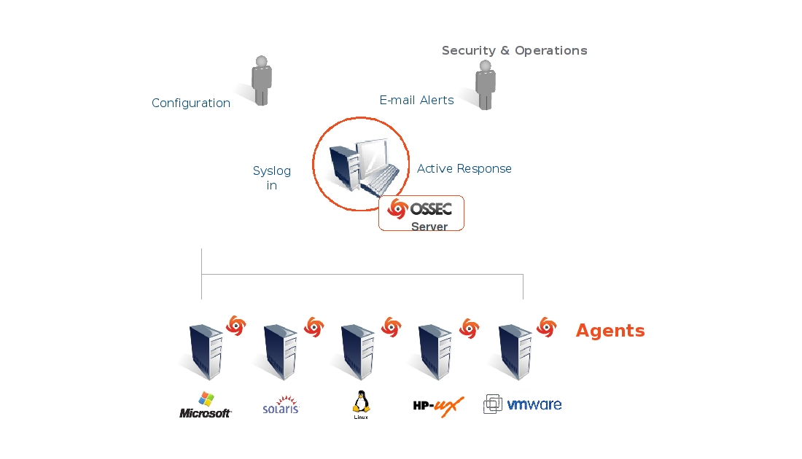

.. _ossec-architecture:

OSSEC Architecture
==================

OSSEC is composed of multiple pieces. It has a central manager monitoring 
everything and receiving information from agents, syslog, databases and from 
agentless devices.

Manager
~~~~~~~

The manager is the central piece of the OSSEC deployment. It stores the file 
integrity checking databases, the logs, events and system auditing entries. 
All the rules, decoders and major configuration options are stored centrally in 
the manager, making it easy to administer even a large number of agents.

Agents
~~~~~~

The agent is a small program or collection of programs installed on the systems 
you desire to monitor. The agent will collect information in real time and forward 
it to the manager for analysis and correlation. It has a very small memory and CPU 
footprint by default, not affecting system?\x80\x99s usage.

*Agent security*: It runs with a low privilege user (created during the 
installation) and inside a chroot jail isolated from the system. Most of the 
agent configuration is pushed from the manager, with just some of configuration 
stored locally on each agent. In case these local options are changed, the manager 
will receive the information and will generate an alert.

Agentless
~~~~~~~~~
For systems that you can’t install an agent, OSSEC allows you to perform file 
integrity monitoring on them without the agent installed. It can be very useful 
to monitor firewalls, routers and even Unix systems where you are not allowed 
to install the agent.

Virtualization/VMware
~~~~~~~~~~~~~~~~~~~~~

OSSEC allows you to install the agent on the guest operating systems or inside 
the host (VMware ESX). With the agent installed inside VMware ESX you can get 
alerts about when a VM guest is being installed, removed, started, etc. It 
also monitors logins, logouts and errors inside the ESX server. In addition to 
that, OSSEC performs the Center for Internet Security (CIS) checks for VMware, 
alerting if there is any insecure configuration option enabled or any other issue.

Firewalls, switches and routers
~~~~~~~~~~~~~~~~~~~~~~~~~~~~~~~

OSSEC can receive and analyze syslog events from a large variety of firewalls, 
switches and routers. It supports all Cisco routers, Cisco PIX, Cisco FWSM, 
Cisco ASA, Juniper Routers, Netscreen firewall, Checkpoint and many others.

Architecture
------------

This diagram shows the central manager receiving events from the agents and 
system logs from remote devices. When something is detected, active responses 
can be executed and the admin is notified.

Internal Architecture
~~~~~~~~~~~~~~~~~~~~~

For technical and deep detailed information on how it works, please read the 
following documents:

`OSSEC log analysis/inspection architecture <http://ossec.net/ossec-docs/auscert-2007-dcid.pdf>`_ (PDF) - by Daniel Cid

Support
~~~~~~~

Everyone knows that support and technical expertise are critical in ensuring the 
success of any product deployment. With an open source project this is not 
different. If you need enterprise-class commercial support for OSSEC, Trend 
Micro, the company behind this great open source project, offers this option 
to our users. For more information, visit the `OSSEC commercial support page <http://www.ossec.net/main/get-commercial-support>`_.
 

