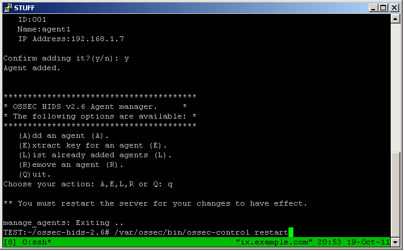
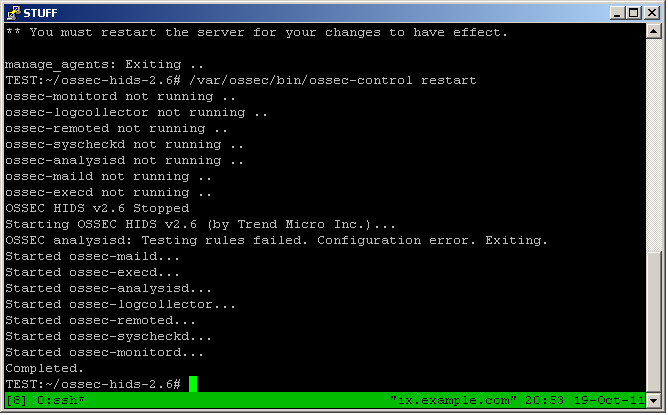

.. _ossec_101_install_server:

OSSEC 101: Server Installation
------------------------------

Things to keep in mind:
^^^^^^^^^^^^^^^^^^^^^^^

Many of the OSSEC daemons chroot to the installation directory (``/var/ossec`` is the default, and is the reference directory for this document).
All logs are currently kept in the ``/var/ossec/logs`` directory. Some log files are rotated daily, but OSSEC does not move logs outside of ``/var/ossec/logs``.
Depending on a number of factors these logs can become large, so make sure you have enough space to store the logs you want to keep.

Related to the amount of storage space you give to OSSEC is the "events per second" (EPS) you expect to receive. 
Michael Starks has provided a script to determine EPS in a blog post: `3WoO Day 2: Calculating Your EPS <http://www.immutablesecurity.com/index.php/2011/10/24/3woo-day-2-calculating-your-eps/>`_.
There has not been any formal load testing on OSSEC, but some informal testing has shown a local installation can handle 11,000 EPS. (`email <http://osdir.com/ml/ossec-list/2010-09/msg00217.html>`_ by Christopher Moraes)
This test was done under mostly ideal conditions, but we would be interested in hearing performance reports from other users.

The number of rules and agents can also affect the speed of the OSSEC manager, and the amount of space necessary for to hold the logs. More agents means more logs.
 
Installation process:
^^^^^^^^^^^^^^^^^^^^^

* Download the OSSEC tarball and pgp/gnupg signature from `ossec.net <http://www.ossec.net/main/downloads>`_.

.. image:: images/install/download.png
   :align: center
   :alt: OSSEC download

* Use GnuPG or PGP to verify the download. Use ``gpg --import OSSEC-GPG-Key.asc`` to import the OSSEC gpg key, then ``gpg --verify ossec-hids-2.6.tar.gz.sid ossec-hids-2.6.tar.gz`` to verify the signature and file.

.. image:: images/install/gpg-verify.png
   :align: center
   :alt: gpg --verify ossec-hids-2.6.tar.gz

* Unpack the tarball and change into the new directory with ``tar -zxf ossec-hids-2.6.tar.gz``. Run the install.sh script to perform the installation ``./install.sh``:

.. image:: images/install/install_sh.png
   :align: center
   :alt: cd ossec-hids-2.6 && ./install.sh

* Verify the information and press ENTER:

.. image:: images/install/install_info.png
   :align: center
   :alt:  OSSEC installation information

* The installation type for this install will be server, and we are using the default install directory:

.. image:: images/install/install_questions.png
   :align: center
   :alt: OSSEC installation questions

* This installation will be configured to send email, integrity check daemon, and the rootkit detection engine ([y] defaults to yes):

.. image:: images/install/more_questions.png
   :align: center
   :alt: OSSEC more installation questions

* We will be disabling active response for now (active response will be covered later):

.. image:: images/install/active-response.png
   :align: center
   :alt: OSSEC disable active response

* We will also disable remote syslog (this will also be covered later). The script provides us with information on an additional file that will be analyzed in addition to the typical logfiles. Press enter to continue:

.. image:: images/install/disable-syslog.png
   :align: center
   :alt: OSSEC disable syslog

* At this point OSSEC will be compiled. Hopefully there are no errors. After compilation has completed, the script provides more information:

.. image:: images/install/post-installation.png
   :align: center
   :alt: OSSEC post installation message

Adding an agent:
^^^^^^^^^^^^^^^

* Adding agents is done with the manage_agents application:

.. image:: images/install/manage_agents_intro.png
   :align: center
   :alt: cd /var/ossec/bin && ./manage_agents

* The manage_agents menu is simple, enter ``a`` to add an agent:

.. image:: images/install/manage_agents_add.png
   :align: center
   :alt: Add an agent with a

* Enter the agent's information. In the IP address field a CIDR (192.168.1.0/24) or ``any`` can be used:

.. image:: images/install/manage_agents_add2.png
   :align: center
   :alt: OSSEC manage_agents agent information

* After confirming the addition, manage agents will notify you that the OSSEC processes must be restarted:

.. note::

   Restarting the OSSEC processes is only necessary for the initial agent.
   While subsequent additions will still give the message, the restart is not necessary.

* Restarting the OSSEC processes:

