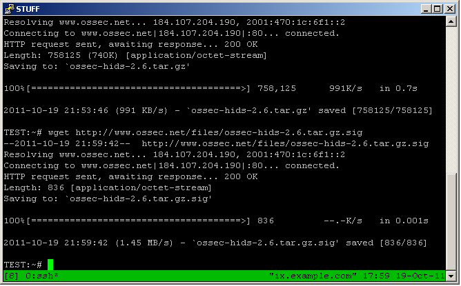
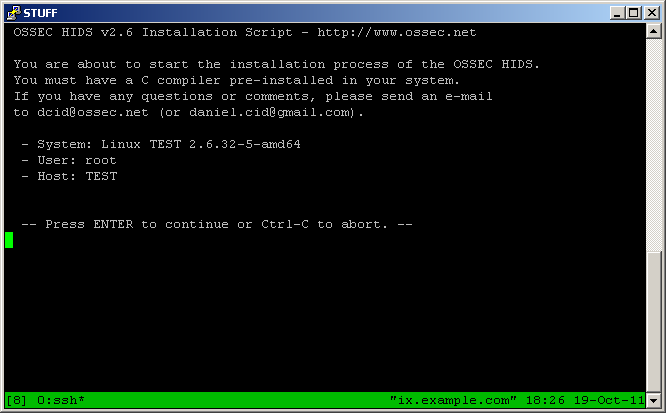

.. _ossec_101_install_server:

OSSEC 101: Server Installation
------------------------------

Things to keep in mind:
^^^^^^^^^^^^^^^^^^^^^^^

  * space requirements
  * # of rules
  * # of agents
  * EPS

 
Installation process:
^^^^^^^^^^^^^^^^^^^^^

* Download the OSSEC tarball and signature:

* Use GnuPG or PGP to verify the download:

.. image:: images/install/gpg-verify.png
   :align: center
   :alt: OSSEC verify gpg 

* Unpack the tarball and change into the new directory. Run the install.sh script:

.. image:: images/install/install_sh.png
   :align: center
   :alt: OSSEC run install.sh

* Verify the information and press ENTER:

* The installation type for this install will be server, and we are using the default install directory:

.. image:: images/install/install_questions.png
   :align: center
   :alt: OSSEC installation questions

* This installation will be configured to send email, integrity check daemon, and the rootkit detection engine ([y] defaults to yes):

.. image:: images/install/more_questions.png
   :align: center
   :alt: OSSEC more installation questions

* We will be disabling active response for now (active response will be covered later):

.. image:: images/install/active-response.png
   :align: center
   :alt: OSSEC disable active response

* We will also disable remote syslog (this will also be covered later). The script provides us with information on an additional file that will be analyzed in addition to the typical logfiles. Press enter to continue:

.. image:: images/install/disable-syslog.png
   :align: center
   :alt: OSSEC disable syslog

* At this point OSSEC will be compiled. Hopefully there are no errors. After compilation has completed, the script provides more information:

.. image:: images/install/post-installation.png
   :align: center
   :alt: OSSEC post installation message

Adding an agent:
^^^^^^^^^^^^^^^

