.. _ossec_101_install_agent_linux:

OSSEC 101: Installing a Linux Agent
-----------------------------------

Things to keep in mind:
^^^^^^^^^^^^^^^^^^^^^^^

Just like the server installation most of the agent OSSEC processes chroot themselves to ``/var/ossec``. Unlike the server version, an agent installation does not store as many logs. The main logs are ``/var/ossec/logs/ossec.log`` and ``/var/ossec/logs/active-responses.log`` if you are using active response. Be sure to allow ample space for these log files.

Installation process:
^^^^^^^^^^^^^^^^^^^^^

* Download the OSSEC tarball and pgp/gnupg signature from `ossec.net <http://www.ossec.net/main/downloads>`_.

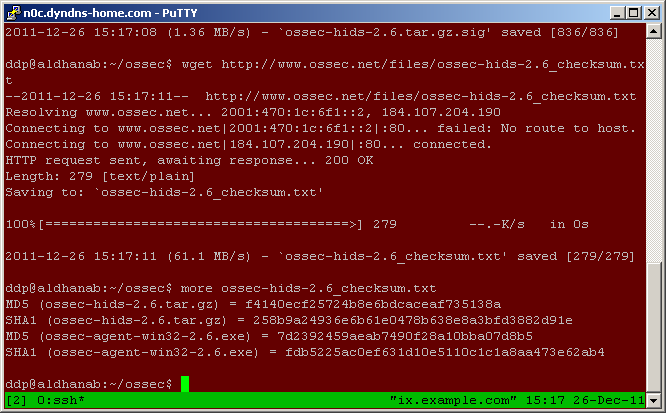

* Use GnuPG or PGP to verify the download. Use ``gpg --import OSSEC-GPG-Key.asc`` to import the OSSEC gpg key, then ``gpg --verify ossec-hids-2.6.tar.gz.sid ossec-hids-2.6.tar.gz`` to verify the signature an
d file.

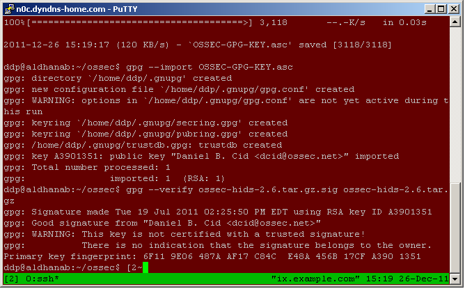

* Unpack the tarball and change into the new directory with ``tar -zxf ossec-hids-2.6.tar.gz``. Run the install.sh script to perform the installation ``./install.sh``:

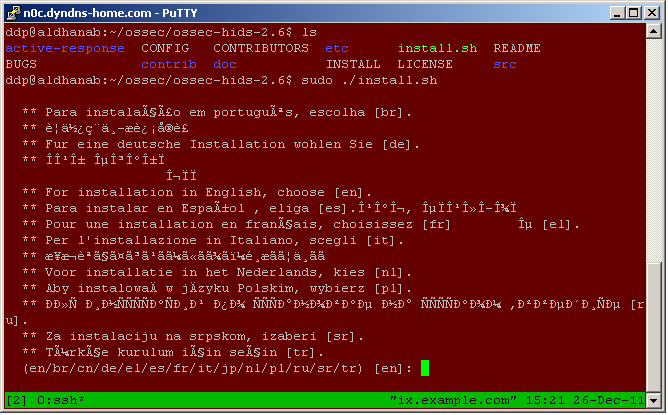

* The install.sh script will display information about the host including the user name and hostname. Press enter to continue.

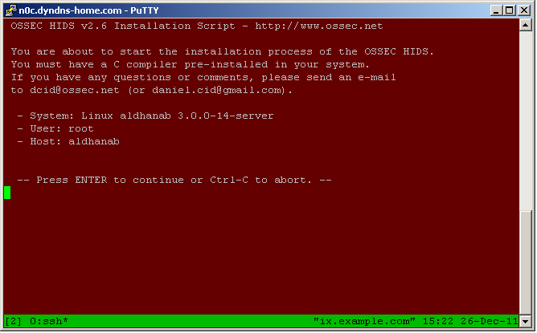

* Select ``agent`` as the type of installation and select an installation location (as usual, we're using the default):

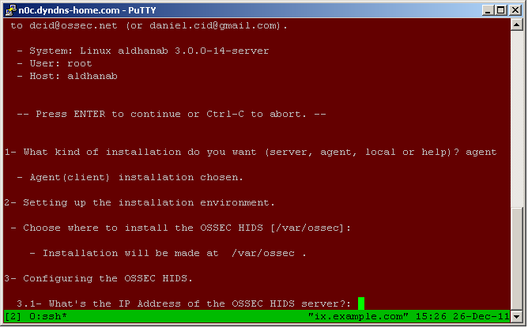

* Enter the IP address of the OSSEC manager. This will automatically populate the agent's ``ossec.conf`` with this setting:

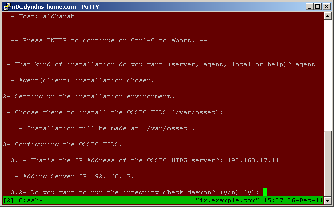

* By default the script will enable file integrity checking, rootkit checking, and active-response. Right now I've chosen to disable active-response. I want to get more comfortable with OSSEC before telling it to take actions on its own. This will be easy to change later. This screen also mentions that ``/var/log/dpkg.log`` will be monitored in addition to the default log files. If this agent was a Red Hat based Linux distribution instead of Debian based, ``/var/log/yum.log`` would be listed.

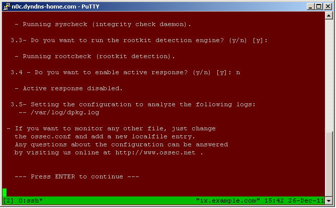

* After this OSSEC will be compiled and installed. If there are errors, double check that you have the proper pre-requisites installed.

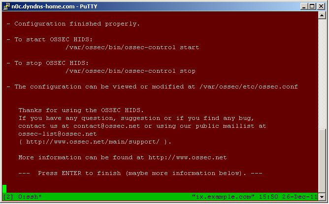

* Now that the installation is complete the encryption key needs to be installed. This key will be created on the manager and copied to the agent. The simplest way to do this is using the ``manage_agents`` utility, although creating keys one by one may be time consuming if there are a lot of agents. Othe methods will be covered later.

Creating the key on the manager:
^^^^^^^^^^^^^^^^^^^^^^^^^^^^^^^^

* On the manager run ``/var/ossec/bin/manage_agents``. Notice the options provided by this application. We will be choosing ``A`` to add an agent. Either ``A`` or ``a`` can be used:

.. image:: images/install/agent_install/0_server_manage_agents.png
   :align: center
   :alt: manage agents

* After selecting ``a`` we have to enter information about the agent. All of these items must be unique. Multiple agents using a single ID, IP, or hostname can cause issues.

  * The agent name does not have to be the hostname, but using the hostname may help with managing the agents.
  * The IP address can be the actual IP address, a CIDR address (192.168.1.0/24), or ``any``. It is best to be as specific as possible, but monitoring VPN or DHCP users is sometimes necessary. CIDR addresses and ``any`` do not have to be unique.
  * The ID will be used for a number of OSSEC functions. Finding the ID is easy, so I typically choose the default.

.. image:: images/install/agent_install/1_server_manage_agents.png
   :align: center
   :alt: enter information about the agent

* After confirming that the agent should be created and the information is correct, you will be presented with the original menu again. This time use ``L`` to list the agents. Notice there is only 1 agent on this system. The list can get much larger, some people reportedly having over 1,000 agents on a single server.

.. image:: images/install/agent_install/2_server_manage_agents.png
   :align: center
   :alt: agent list

Exporting the agent key:
^^^^^^^^^^^^^^^^^^^^^^^^

* The ``manage_agents`` menu offers an option to ``(E)xtract key for an agent (E).`` This option extracts the key (base64 encoded) so it can be transfered to the agent. A simple copy & paste is all that is necessary to install it.

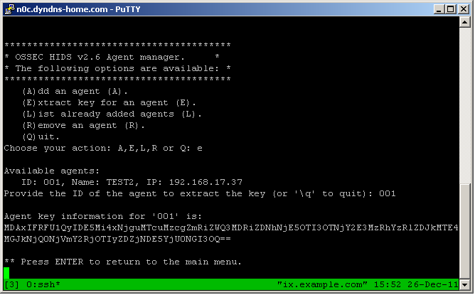

.. warning:

    These keys are sensitive information. With them an attacker may be able to decrypt the information passing back and forth or worse.

Importing the agent key:
^^^^^^^^^^^^^^^^^^^^^^^^

* Importing the key on the agent is simple. We'll use the ``manage_agents`` on the agent as well. Notice the list of available actions is much smaller on the agent.

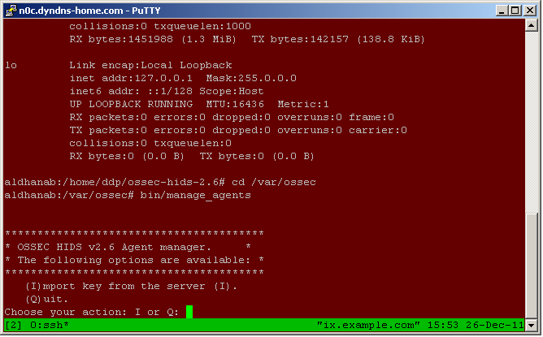

* Select ``I`` to import the key and paste the key we got from the manager's ``manage_agents`` application.

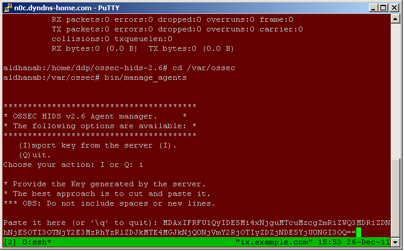

* Confirm the information provided.

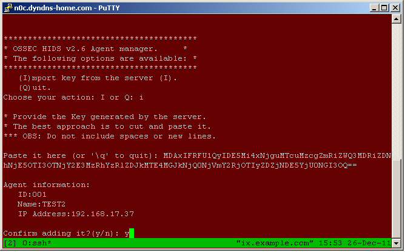

* Finally, restart the agent's OSSEC processes using ``ossec-control``.

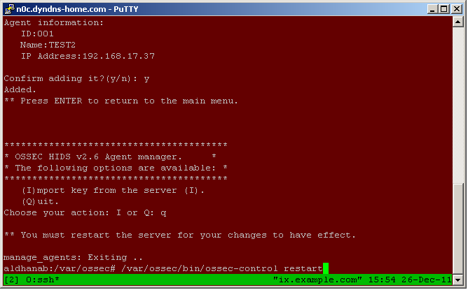

