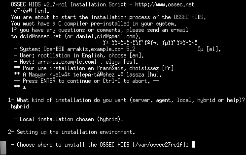

.. _ossec_101_install_hybrid:

OSSEC 101: Hybrid Installation
------------------------------

The hybrid installation method combines an OSSEC server with an OSSEC agent. This allows a system to be a server for a number of agents, and to be an agent to another server. By default the hybrid installation type installs the server portion to ``/var/ossec``, and the agent in ``/var/ossec/ossec-agent``.

Things to keep in mind:
^^^^^^^^^^^^^^^^^^^^^^^

This will be multiple fully functioning OSSEC installations, make sure you plan for the necessary disk space. For instance, one of my hybrid servers shows the following:

.. code-block:: console:

   $ sudo du -hs /var/ossec/ossec-agent/
   1.2G    /var/ossec/ossec-agent/

Installation process:
^^^^^^^^^^^^^^^^^^^^^

* The install.sh script will display information about the host including the user name and hostname. Press enter to continue.

* Select ``hybrid`` as the type of installation and select the installation location:

.. image:: images/install/hybrid_information.png
   :align: center
   :alt: select hybrid

* Prepare for compilation:

.. image:: images/install/hybrid_information_message.png
   :align: center
   :alt: installation information

* The server side's compilation is complete:

.. image:: images/install/hybrid_server_installation_complete.png
   :align: center
   :alt: installation complete

* Next configure the agent portion of the hybrid installation:

.. image:: images/install/hybrid_agent_config.png
   :align: center
   :alt: Configure agent 

* After successfully compiling the agent portion you should see a screen similar to this:

.. image:: images/install/hybrid_agent_complete.png
   :align: center
   :alt: Install complete

* Now that the installation is complete the encryption key needs to be installed. This key will be created on the manager and copied to the agent. The simplest way to
do this is using the ``manage_agents`` utility, although creating keys one by one may be time consuming if there are a lot of agents. Othe methods will be covered late
r.

Configuring the system as an agent:
^^^^^^^^^^^^^^^^^^^^^^^^^^^^^^^^^^^

