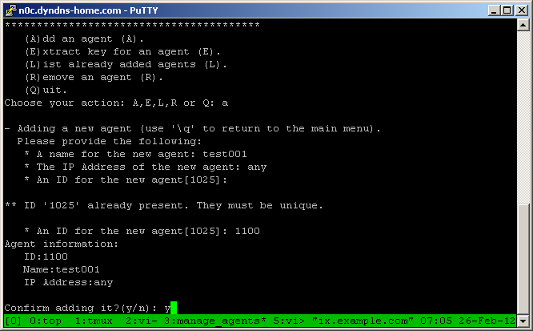

.. _ossec_101_manage_agents:

manage_agents:
--------------

``manage_agents`` is a menu based application available on both agents and servers, but performs different tasks on each. On the server it is used to add or remove an agent and retrieve the key for the an agent. On an agent manage_agents will import an authentication key.

Available actions on the manager:
^^^^^^^^^^^^^^^^^^^^^^^^^^^^^^^^^

The available actions on the manager are to add an agent, extract the key for an agent, list the current agents, remove an agent, and quit the application. Select an action by typing the letter in parentheses.

.. image:: images/0_manage_agents.png
   :align: center
   :alt: manage_agents menu

Adding an agent:
^^^^^^^^^^^^^^^^

Adding an agent is simple, start by typing ``a`` and hitting ``enter``. You will be prompted for a name for the agent. This can be any alpha numeric string, and it often the hostname of the system. This will be one of the ways an agent is identified, so make sure it's something you will understand.

Next you're prompted for an IP address for the agent. There are three ways to enter a value here. You can enter the actual IP address of the system, which is the preferred method. If the system uses DHCP this won't be possible, so you can also enter the DHCP range in CIDR notation (``192.168.1.0/24``). If you can't be sure what IP the agent will use you can enter ``any`` to allow any IP address. 

Lastly you will be asked for an agent ID. This should be a unique value used to identify agents. Generally manage_agents will provide the next available ID as the default, but ``ossec-authd`` can occassionally confuse manage_agents. manage_agents will ensure the ID is unique. Once an ID has been used it cannot be reused.

Viewing a list of the agents:
^^^^^^^^^^^^^^^^^^^^^^^^^^^^^

Type '``L``' at the menu prompt to view the agents on the system.

.. image:: images/2_manage_agents_list.png
   :align: center
   :alt: manage_agents: list agents

Removing an agent:
^^^^^^^^^^^^^^^^^^

Type '``R``' at the prompt to remove an agent. manage_agents prompts for the agent id, and confirms that the agent should be deleted. After an agent has been deleted, it cannot be un-deleted. It has to be re-added instead.

.. image:: images/3_manage_agents_remove.png
   :align: center
   :alt: manage_agents: remove an agent

