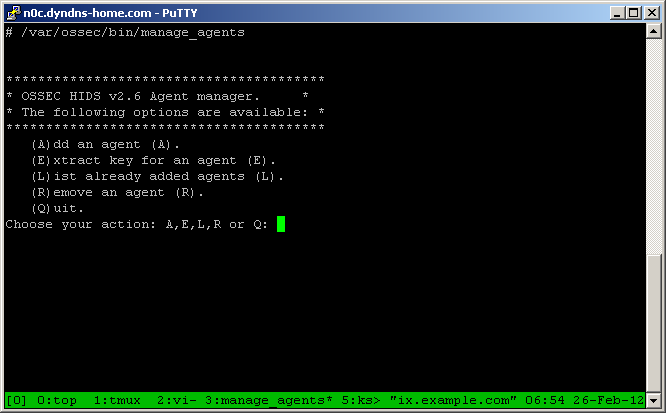
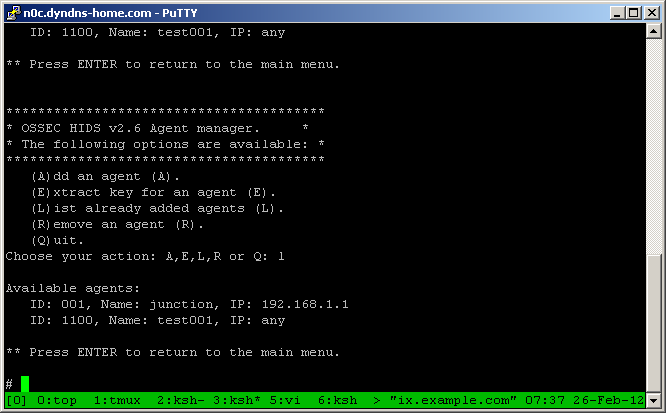
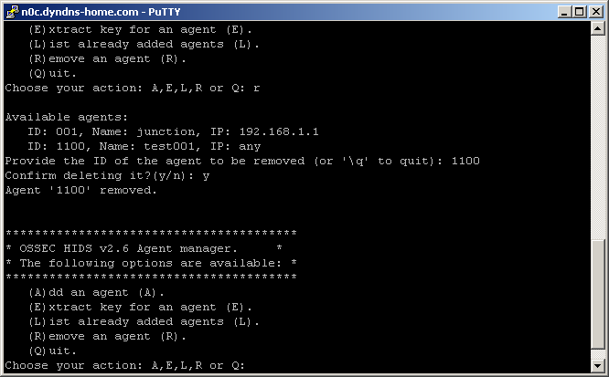
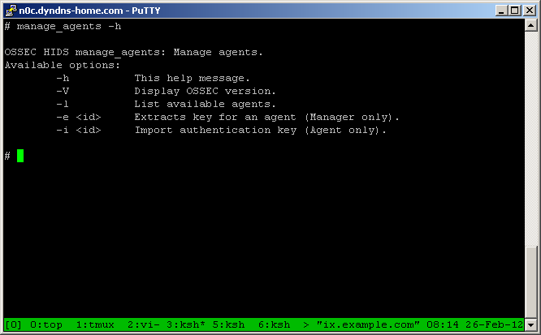

.. _ossec_101_manage_agents:

manage_agents:
--------------

``manage_agents`` is a menu based application available on both agents and servers, but performs different tasks on each. On the server it is used to add or remove an agent and retrieve the key for the an agent. On an agent manage_agents will import an authentication key.

Available actions on the manager:
^^^^^^^^^^^^^^^^^^^^^^^^^^^^^^^^^

The available actions on the manager are to add an agent, extract the key for an agent, list the current agents, remove an agent, and quit the application. Select an action by typing the letter in parentheses.

Adding an agent:
^^^^^^^^^^^^^^^^

.. include:: add_agent.trst

Viewing a list of the agents:
^^^^^^^^^^^^^^^^^^^^^^^^^^^^^

Type '``L``' at the menu prompt to view the agents on the system.

Removing an agent:
^^^^^^^^^^^^^^^^^^

Type '``R``' at the prompt to remove an agent. manage_agents prompts for the agent id, and confirms that the agent should be deleted. After an agent has been deleted, it cannot be un-deleted. It has to be re-added instead.

manage_agents on an agent:
^^^^^^^^^^^^^^^^^^^^^^^^^^

The only option available when using manage_agents on an agent is to import the authentication key.

Using manage_agents at the command line:
^^^^^^^^^^^^^^^^^^^^^^^^^^^^^^^^^^^^^^^^

``manage_agents`` has a number of command line options. The most important ones are ``-h``, ``-l``, ``-e``, and ``-i``. 

  * ``-h`` prints the help message.
  * ``-l`` lists the available agents.
  * ``-e <id>`` extracts the authentication key for the agent id.
  * ``-i <id>`` imports the authentication key on an agent.

``manage_agents`` help message:

